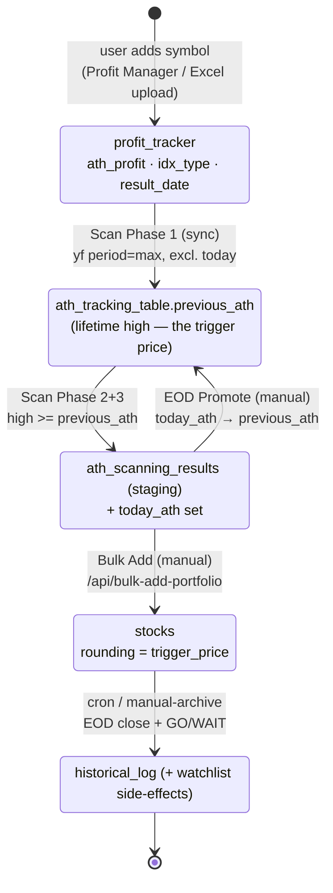

# StockTrackerApp — Workflows & Architecture

This document maps how the app actually works end-to-end: every major user-facing workflow, which routes and modules implement it, which tables it reads/writes, and how the pieces connect (or don't). It's a companion to `CLAUDE.md` (which is terse operational guidance) — this one is the deep, holistic picture, written after tracing every route in `app.py` against its backing module and template.

The app is a single-user-oriented (currently capped at 50 accounts) Flask monolith for tracking and researching NSE/BSE equities: a rules-based "ATH breakout" trading system, a 4-pillar fundamental scoring model, sector/market analytics, portfolio and watchlist tracking, a PMS fund-review tool, and price alerts. There is no external market-data service — every price, history, fundamental, and news item is fetched live from `yfinance` at request time (with several ad-hoc SQLite caching layers to avoid hammering it).

## 1. The big picture

Two independent "engines" sit at the heart of the app and rarely talk to each other directly — they're stitched together by the user manually moving data between tables via the UI:

```mermaid
flowchart LR
    subgraph Universe["Curated ticker universe"]
        PT[("profit_tracker<br/>(ATH-profit Y/N, FNO/TM, result date)")]
    end

    PT --> SCAN["ATH Scanner<br/>scanner_engine.py (live)<br/>ath_scanner.py (legacy, still wired)"]
    SCAN --> ATT[("ath_tracking_table<br/>ath_scanning_results")]
    ATT --> REVIEW{{"User reviews scan hits<br/>on /ath-scanner"}}
    REVIEW -->|"EOD Promote<br/>(today_ath → previous_ath)"| ATT
    REVIEW -->|"Bulk Add to Tracker"| STOCKS[("stocks<br/>(today's daily tracker)")]
    PT -.joined by symbol.-> STOCKS

    STOCKS --> TRIGGER["get_investment_category()<br/>+ GO/WAIT rule<br/>(duplicated in app.py & daily_tasks.py)"]
    TRIGGER --> DASH["/dashboard, /go-list"]
    TRIGGER --> ARCHIVE["Daily Archive<br/>daily_tasks.perform_archive_for_user<br/>(cron via run_pa.sh, or /manual-archive)"]
    ARCHIVE --> HIST[("historical_log")]
    ARCHIVE -->|"remark ⇒ WAIT reasons"| WATCH[("watchlist")]

    subgraph Scoring["Fundamental scoring"]
        FA["/fundamental-analysis<br/>fundamental_analysis.py + ScoringEngine"]
    end
    FA --> SCOREHIST[("scoring_history")]
    SCOREHIST --> TURTLE["Turtle Dashboard<br/>market_stats.py<br/>(populated by /run_market_scan)"]
    SCOREHIST -.only if ath_tracker.db is<br/>separately seeded.-> SECTORDB[("ath_tracker.db<br/>sector_scores etc.")]
    SECTORDB --> SECTORS["/sectors pages<br/>(read-only via SectorAnalytics)"]
```

Everything else (Portfolio, Watchlist, Performance, PMS Fund Review, Alerts, News, Deep Analytics) is a mostly-independent satellite that reads live prices/fundamentals through the shared `DataManager` cache and its own tables, without feeding back into the scanner/tracker pipeline above.

## 2. Data stores (three separate SQLite files — not one)

| File | Driven by | Used for |
|---|---|---|
| **`tracker.db`** (path from `DATABASE_PATH` env var, default repo root) | `app.py`, `daily_tasks.py`, `data_manager.py`, `scanner_engine.py`, `ath_scanner.py`, `scanner_status.py`, `market_stats.py`, `alerts_manager.py` | Everything user/session-facing: auth, daily tracker, profit tracker, portfolios/holdings, watchlist, history, alerts, fund snapshots, scoring history, scanner staging/state tables, DataManager's own price/fundamental/history caches |
| **`ath_tracker.db`** (hardcoded relative path in `sector_analytics.py`) | `SectorAnalytics` class, `setup_sector_analytics.py` | `sector_scores`, `sector_risk_metrics`, `sector_alerts`, `sector_company_contributions`. **`app.py`'s `/sectors*` routes only ever read from this via `SectorAnalytics.get_sector_ranking()`/queries — they never call the class's `compute_sector_scores()`/`compute_risk_metrics()` write methods.** Those are only invoked by the standalone `setup_sector_analytics.py` script, run manually/offline. If nobody has run that script against `ath_tracker.db`, the Sector Analytics pages render empty. |
| **`widget_cache.db`** (hardcoded relative path in `app.py`) | Dashboard performer widget only | `performer_cache` table (best/worst performer per user) — a bespoke cache that bypasses `DataManager` entirely and talks to `yfinance` directly |

Within `tracker.db`, table creation is itself scattered across `init_base_tables.py`, `init_alerts_db.py`, `init_sector_db.py` (writes to `ath_tracker.db`, not `tracker.db`, despite the name), `app.py:create_tables()`, ad-hoc `CREATE TABLE IF NOT EXISTS` in `data_manager.py`/`scanner_engine.py`, and one-off `migrate_*.py` scripts for column additions. There is no single schema file — see `CLAUDE.md` for the full table inventory.

## 3. Navigation map

The nav bar (`templates/base.html`) groups every workflow below into three menus plus auth:

- **Research**: Turtle Dashboard, Sector Analytics, Fundamental Analysis, Deep Analytics (Sector), News Feed, Results Calendar
- **Portfolio**: Portfolio, Watchlist, Profit Manager, Trade History, Performance, PMS Review
- **Trading Tools**: GO List (Breakouts), ATH Scanner, Price Alerts

`/` itself is not a page — it just redirects to `/login`. The home page after login is `/dashboard`.

## 4. Workflows in depth

### 4.1 Auth
`/signup` (hard-capped at 50 users) hashes passwords with `werkzeug.security.generate_password_hash`; `/login` verifies and calls `login_user`; `/logout` calls `logout_user`. Session cookie is signed with a **hardcoded** `app.secret_key` (`'ATH_SCANNER_FIXED_SECRET_KEY_V1'`) — intentional, per its comment, so users aren't logged out when the dev server reloads.

### 4.2 Daily Tracker & GO List (`stocks` table)
The operational core. `/dashboard` LEFT JOINs `stocks` with `profit_tracker` (by symbol+user) and batch-fetches live prices via `get_live_prices_cache()` → `DataManager` (5-min cache). Adding a stock (`/add`, `/add_stock_ajax`) validates the ticker, upserts a `profit_tracker` row if missing, then inserts into `stocks` (rounding, stop_loss, ath_outperformance, is_green_candle, is_close_above_ath — these three flags are entered by hand, not computed by the app itself here).

Every row is classified by the same rule, computed inline wherever it's needed (dashboard, GO List, archive) — **not** a shared/importable function, and duplicated verbatim between `app.py` and `daily_tasks.py`:

```
category, remark = get_investment_category(ath_outperformance, ath_profit, idx_type)
  ath_outperformance != 'Y'                                   → NO ENTRY ("ATH OP is 'N'")
  ath_outperformance == 'Y' and ath_profit == 'Y'             → FUND    (idx_type irrelevant)
  ath_outperformance == 'Y' and ath_profit != 'Y' and FNO     → PROP
  ath_outperformance == 'Y' and ath_profit != 'Y' and not FNO → NO ENTRY ("Index is not 'FNO'")

ATH outperformance is the hard gate — nothing enters without it. ath_profit == 'Y'
promotes to FUND on its own; FNO-only names fall back to PROP.

is_tracked = category in (FUND, PROP)
price_gt_rounding = cmp > rounding
final_trigger = "GO" if is_tracked and is_green_candle=='Y'
                        and price_gt_rounding and is_close_above_ath=='Y'
                else "WAIT"
```

`/go-list` re-runs this filter (recomputed inline again, a third copy of the same conditional) to show only the `GO` subset, fetching live prices one-by-one rather than batched. Deleting from the daily tracker (`/delete`, `/delete-all`, `/delete-selected`) never touches `profit_tracker` — the cascade only goes the other direction (see 4.3).

### 4.3 Profit Manager & Results Calendar (`profit_tracker` table)
`/profit-manager` lists/searches the permanent per-symbol master record (`ath_profit` Y/N, `idx_type` FNO/TM, `result_date`). Toggle routes flip `ath_profit`/`idx_type` in place. Deleting a symbol here (`/delete-profit-record`, `/delete-profit-entries`) **cascades** into `stocks`, `watchlist`, and (for the bulk route) `historical_log` — the asymmetric opposite of 4.2.

Bulk edits use a two-step preview→confirm pattern backed by the `upload_previews` staging table: `/upload-ath-profit-preview` and `/upload-result-date-preview` validate an uploaded spreadsheet, diff it against existing rows, and stash the plan as JSON; `/confirm-ath-profit-upload` / `/confirm-result-date-upload` apply it. A legacy one-shot `/upload-profits` route also exists and upserts directly with no preview step.

`/results-calendar` filters `profit_tracker.result_date`, surfacing `'CONFLICT'` sentinel values separately. `/refresh-result-dates` doesn't scrape locally — it calls the PythonAnywhere Consoles API to kick off `run_pa.sh`, which runs `daily_tasks.update_all_result_dates()` (screener.in scraping via BeautifulSoup) on the production host. This only works when deployed on PythonAnywhere with the credentials that script expects.

### 4.4 Trade History / Daily Archive (`historical_log` table)
`daily_tasks.archive_all_users()` (invoked by cron via `run_pa.sh`, or on-demand per-user via `/manual-archive`) computes the correct trading-day log date (weekends roll back to Friday), fetches true EOD closes from `yfinance`, and re-runs the same category/GO-WAIT logic using each stock's *stored* flags (not live-recomputed ones) to write one `historical_log` row per tracked stock. It's idempotent (deletes that user+date's rows before reinserting) but **does not clear `stocks`** — the daily tracker persists across archive runs; it's not date-scoped.

As a side effect, archiving also maintains `watchlist`: a `GO` result removes any existing watchlist entry for that symbol; specific WAIT remarks (`Rounding > CMP`, `ATH Profit is 'N'`, `ATH OP is 'N'`) add one. `/history`, `/history/<date>`, `/history/search` browse the log; `/upload-history` **destructively replaces** the entire log from a backup Excel file (not a merge).

### 4.5 ATH Breakout Scanner
The most complex subsystem, and it has **two live implementations wired into the same page** (`/ath-scanner`, `templates/ath_scanner.html`):

- **`scanner_engine.py`** (current/primary, imported at `app.py:2970`) — a 3-phase batch design:
  1. **Sync**: any `profit_tracker` symbol missing from `ath_tracking_table` gets a full `yf.download(period="max")` to seed its lifetime-high baseline (`previous_ath`).
  2. **Fast batch detect**: 50-ticker batches, 5-day history, flags "potential hits" where today's high ≥ stored `previous_ath`.
  3. **In-depth analysis** (only for hits): Green Candle (`close ≥ prev_close`), Close > ATH (`close > previous_ath`), and RS Outperformance — a 211-day "rolling fixed-anchor RS" against Nifty 500 (`^CRSLDX`, no fallback index — see §7.17): anchor the stock/index close ratio at the start of the window, and flag `Y` if today's anchored ratio is within 0.01% of the window's max.
  Results land in `ath_scanning_results` (wiped/rebuilt each run) and `ath_tracking_table.today_ath`.
- **`ath_scanner.py`** (`ATHScanner` class, still imported and instantiated at `app.py:2988`/`3013`, driving `/api/ath/run-daily` and `/api/ath/run-refresh`) — an older single-strategy, non-batched ATH-break detector, explicitly labeled `LEGACY SCANNER` in the template JS/button IDs. **It is wired to live buttons but non-functional**: it reads and writes an `ath_price` column that does not exist in the current `ath_tracking_table` schema (the column is `previous_ath`), so both its scan methods raise `OperationalError: no such column: ath_price`. See §6 for the full defect list.

Both are backed by `scanner_status.py`'s `ScannerStatusManager`, which persists scan progress to the `scanner_state` table (keyed by `user_id`) specifically because gunicorn runs multiple worker processes — an in-memory progress dict can't be polled cross-process, so the frontend's `setInterval` polling (`/api/scanner/status`, aliased to `/api/ath/status`) reads the DB instead.

**EOD Promote** (`/api/eod-promote` → `promote_ath_eod`) is the manual, opt-in step that turns a confirmed intraday high into the new permanent baseline: copies `today_ath → previous_ath` for selected symbols, then clears `today_ath` globally. **Bulk Add to Tracker** (`/api/bulk-add-portfolio` — despite the name, this writes to `stocks`, not `portfolios`/`holdings`) is how a scan result becomes a row in the daily tracker (4.2), closing the loop back to `profit_tracker`'s universe.

### 4.6 Portfolio & Watchlist
`/portfolio` lists the user's `portfolios`, each with `holdings` (symbol, exit_price, allocation%, `rg_status`). Per holding it computes live `cmp`/`change_pct` (batched via `DataManager`), `from_exit = (exit_price/cmp - 1) * 100`, and an allocation-weighted daily `contribution`, plus a pie-chart payload (with a synthetic "Cash" slice if allocations don't sum to 100). `rg_status` is a free-form `'R'`/`'G'` dropdown tag with **no semantic meaning anywhere in the code** — just a manually-set label, not derived from any calculation.

`/refresh_portfolio_data/<id>` is a separate AJAX path that bypasses `DataManager` entirely and hits `yfinance` directly for a fresher read. Upload/download (`/upload-portfolio`, `/download-portfolio`, and similarly for `/upload-watchlist`/`/download-watchlist`) are **full destructive replace** operations — uploading wipes and re-inserts, not merges. `/api/bulk-add-portfolio`, despite its name, belongs to the scanner workflow (4.5), not this one.

### 4.7 Performance
`/performance` is a read-only rollup: per portfolio, `total_value = Σ(allocation% × cmp)` and `total_change` = a simple (not allocation-weighted) mean of holdings' daily change%, using the same 5-min `DataManager` cache as the dashboard. Holdings with no resolvable price are silently excluded from the aggregate.

### 4.8 Fundamental Analysis, Scoring & Checklist
`/fundamental-analysis` is a wizard: enter a symbol, optionally override any of 21 weight sliders (4 pillars + 17 sub-factors), and `get_stock_fundamentals()` (`fundamental_analysis.py`) scores it — Growth/Profitability(Quality)/Valuation/Technicals at default weights 30/25/20/25, with BFSI-specific metric swaps (ROE↔ROCE etc.), sector-relative percentiles via `sector_manager.SectorManager`, and technicals (RSI/CAGR/drawdown) via its own `get_technical_analysis()`. This produces a 0–100 `health_score` and a grade (Strong Buy ≥80, Buy ≥60, Hold ≥40, else Sell), logged once per symbol per day into `scoring_history` via `log_scoring_run()`.

**Note**: this is a *second, independent* implementation of the same "4-pillar" idea — `scoring_engine.ScoringEngine` implements a stricter, hard-bucketed version of the identical 30/25/20/25 model, but `fundamental_analysis.py` does not call it; the two coexist rather than sharing logic.

The **checklist** (`fundamental_checklist` table: `analysis_status`, `fund_allocation`, `breakout_status`) is a separate manual tracking log surfaced as a tab on `/portfolio` — it doesn't trigger or read scoring itself.

### 4.9 Turtle Dashboard
`/dashboard/turtle` reads pre-computed market breadth (`market_stats_history`) and top-50 ranked stocks (`stock_analytics_snapshot`) via `MarketStats.get_dashboard_data()`. That data only exists after someone manually triggers `/run_market_scan`, which runs `MarketStats.calculate_daily_stats()`: iterates every distinct symbol in `stocks`, pulls 1y history, computes RS return/ATH proximity/200DMA breadth/trend state, joins in the latest `scoring_history` score, and upserts both tables — including a market "regime" label (BULLISH/BEARISH/NEUTRAL) from 200DMA breadth and ATH proximity thresholds. `/turtle-research` is a bare redirect to this same page (legacy alias).

### 4.10 Sector Analytics
`/sectors`, `/sectors/<name>`, `/sectors/export/csv`, `/api/sector-scatter-data` all **read** `sector_scores`/`sector_risk_metrics`/`sector_company_contributions` from `ath_tracker.db` via `SectorAnalytics` (see §2). The **write/compute** side (`compute_sector_scores()` — market-cap and equal-weighted sector aggregation of `scoring_history`; `compute_risk_metrics()` — beta/alpha/volatility/Sharpe/VaR against sector NSE indices like `^CNXFIN`/`^NSEBANK`) is only ever called from the standalone `setup_sector_analytics.py` script, run manually and disconnected from the live app's request cycle. The `sector_alerts` table exists in the schema (`init_sector_db.py`) but has no read/write code path anywhere — unimplemented.

### 4.11 Deep Analytics (`/analytics`)
A distinct, on-request, user-scoped alternative to 4.9/4.10: builds a universe from the user's `watchlist` + `profit_tracker` + `holdings` (capped to 20 symbols), scores each fresh via `get_stock_fundamentals()` (no DB caching of the aggregate), and aggregates sector scores in-memory via `analytics_engine.calculate_sector_scores()` — a third, independent reimplementation of "sector aggregation," parallel to but not sharing code with `SectorAnalytics.compute_sector_scores()`. Advances/declines "breadth" here is currently **hardcoded** (`{'advances': 1250, 'declines': 850}`), and `calculate_portfolio_metrics()` is an explicit stub returning fixed placeholder values.

### 4.12 PMS Fund Review
`/fund-review` renders a mostly client-side tool (`static/js/fund_review.js`) tracking two named funds' weekly relative-strength/price tables against Nifty. The backend only provides two things: `/api/fund-review/fetch-prices` (batch `yfinance` lookup to auto-fill a price cell for a given date, not persisted) and `/api/fund-review/snapshots` (CRUD on `fund_snapshots`, keyed `(user_id, fund, review_date, period)`). A "snapshot" is a full immutable JSON blob of the entire review state at that moment — there's no server-side diffing; the "Trends" tab fetches ≥2 snapshots and charts them client-side.

### 4.13 Price Alerts
`/alerts` creates rows (`symbol`, `target_price`, `condition` = `'ABOVE'`/`'BELOW'`) via `alerts_manager.create_alert()`. Critically, **alerts are only ever evaluated on page load of `/alerts` itself** — `check_alerts()` (per-symbol uncached `yfinance` lookup) is called nowhere else in the codebase: no scheduler, no `daily_tasks.py` hook, no background job. There is no notification mechanism beyond an inline banner shown if you happen to be looking at that page when a threshold is crossed.

### 4.14 News Feed
`/news` fetches three separate `yfinance` news sets in parallel (general Nifty, current dashboard `stocks` symbols, current portfolio `holdings` symbols) via `news_feed.get_market_news()` — no caching or persistence, refetched every load.

### 4.15 Dashboard widgets & caching split
The dashboard's "Best/Worst Performer" widget is deliberately split across two routes to keep page load fast: `/dashboard_performer_widget_cached` (used on every page load) just reads the last computed result from `performer_cache` in `widget_cache.db` — instant, no network calls. `/dashboard_performer_widget` (triggered only by an explicit manual refresh button) does the actual N direct `yfinance` calls and writes the new winner/loser back into that cache. A separate, older `/dashboard_widgets_data` JSON endpoint also exists but isn't wired into the current template's JS.

## 5. Cross-cutting: the caching layer

`data_manager.DataManager` (`data_manager.py`) is the shared price/fundamentals/history cache most workflows go through — `stock_price_cache`, `stock_fundamental_cache`, `stock_history_cache` in `tracker.db`, each with its own staleness window. Notable exceptions that **bypass** it and hit `yfinance` directly: the ATH scanner (its own batching needs), `/refresh_portfolio_data`, the dashboard performer widget, `alerts_manager.check_alerts`, `news_feed.py`, and the sector scatter/risk-metric routes. When touching price-fetching code, check whether the surrounding function already goes through `DataManager` before adding a new direct `yfinance` call.

## 6. Known quirks worth knowing before you change things

- `get_investment_category()` — the central GO/WAIT/FUND/PROP rule — is copy-pasted between `app.py` and `daily_tasks.py`, and the GO-list filter in `/go-list` is a third inline reimplementation of the same condition. Changing the trading rule means changing it in three places.
- Two ATH scanners are reachable from the same page, but only `scanner_engine.py` works — the `ath_scanner.py` legacy path is broken (see "Verified defects" below). Confirm which one a bug report is about before debugging.
- Two independent 4-pillar scoring implementations exist (`scoring_engine.ScoringEngine`'s strict-bucket version vs. `fundamental_analysis.py`'s proportional-points version); only the latter is wired into `/fundamental-analysis` and `scoring_history`.
- Sector aggregation is implemented three separate times with three different persistence stories: `SectorAnalytics.compute_sector_scores()` (writes `ath_tracker.db`, only run via the offline `setup_sector_analytics.py` script), `analytics_engine.calculate_sector_scores()` (in-memory, per-`/analytics`-request, user-scoped), and the portfolio-only `analytics_engine.get_portfolio_allocation()`.
- `/sectors*` pages will appear empty on a fresh checkout until someone manually runs `setup_sector_analytics.py` against `ath_tracker.db` — the live app never populates that database itself.
- Deleting a symbol from **Profit Manager** cascades to `stocks`/`watchlist`/`historical_log`; deleting from the **Daily Tracker** does not cascade back to `profit_tracker`. The cascade only goes one direction.
- Portfolio/watchlist upload endpoints **replace**, not merge — re-uploading a partial spreadsheet silently deletes anything not in the file.
- `rg_status` on holdings is a bare `'R'`/`'G'` tag with no defined meaning anywhere in code, comments, or its migration script — it's manual user classification only.
- Price alerts have no scheduler; they're evaluated only when the `/alerts` page happens to be open.
- `app.secret_key` is a fixed literal string (intentional — avoids logging users out on dev-server reload — but means session cookies are forgeable if the key leaks).
- `/api/ath/status` is registered by two different route declarations (`app.py:3000` and `app.py:3328`, the latter stacked with `/api/scanner/status`); both call the identical `status_manager.get_status()`, so it's inert duplication rather than a functional bug, but only one handler is ever reachable for that exact path.
- `analytics_engine.calculate_portfolio_metrics()` is an explicit placeholder stub (fixed beta/alpha/volatility), and its "breadth" (advances/declines) numbers on `/analytics` are hardcoded, not computed.

## 7. Deep dive: the ATH pipeline (workflows §4.3 → §4.5 → §4.2 → §4.4)

Workflows 3, 4 and 5 are not independent features — they are four stages of one loop, and the handoffs between them are all **manual** (a button, an upload, or a cron job), never automatic.



### 7.1 The two-column ATH state machine

`ath_tracking_table` (755 rows in the shipped DB, keyed on `symbol`, **no `user_id` — it is global, not per-user**) carries the whole scanner's memory in two columns:

| Column | Meaning |
|---|---|
| `previous_ath` | The confirmed lifetime high. **This doubles as the trigger price** — `calculate_single_ticker` receives it as `trigger_price`, and Bulk Add maps it into `stocks.rounding`. |
| `today_ath` | Scratch space for an *unconfirmed* intraday breakout. Set by `update_today_ath()` on every hit, cleared globally at the start of every scan (Phase 0) and at the end of every EOD Promote. |

The promote step is the only thing that makes a breakout permanent:

```sql
UPDATE ath_tracking_table SET previous_ath = today_ath, ath_date = <today>
WHERE symbol IN (<selected>) AND today_ath IS NOT NULL AND today_ath > previous_ath;
UPDATE ath_tracking_table SET today_ath = NULL WHERE today_ath IS NOT NULL;  -- global
```

Two consequences worth internalising:
- **Skipping EOD Promote is not neutral — it re-arms the same signal.** `previous_ath` stays where it was, so tomorrow's Phase 2 filter (`live_high >= previous_ath`) flags the identical stock again. A breakout you never promote reappears every day.
- **The global `today_ath` clear is unconditional.** Promoting 2 of 10 hits wipes `today_ath` for the other 8 as well. They aren't lost (they're still in `ath_scanning_results` until the next scan) but their intraday high is gone from the master table.

### 7.2 The Phase 2 filter is `>=`, and the zero-baseline trap

```python
if round(live_high, 2) >= round(current_ath, 2):   # scanner_engine.py:514
```

`>=` (not `>`) means a stock sitting exactly at its recorded ATH is a "hit" every single scan. More importantly, `sync_new_stocks_to_ath_tracker` inserts `previous_ath = 0.0` whenever the batch download fails or a symbol has no history (lines 214, 229, 233-234). **A symbol stuck at `previous_ath = 0.0` passes the filter unconditionally forever** — any positive price is `>= 0` — and it will be reported as an ATH hit with a `trigger_price` of `0.0` on every scan until someone fixes it via `/api/ath/update-record`. Worth a sanity query after adding a batch of new symbols:

```sql
SELECT symbol FROM ath_tracking_table WHERE previous_ath = 0 OR previous_ath IS NULL;
```

### 7.3 The RS-outperformance calculation (the one genuinely subtle formula)

"ATH Outperformance" is *not* a simple return comparison. `calculate_rs_outperformance` builds a **rolling fixed-anchor relative-strength line** anchored `RS_BARS_BACK = 212` bars before the latest bar (`LOOKBACK = 213` rows — see §7.18):

1. Append today's live close to the fetched history, inner-join against the Nifty 500 series (`^CRSLDX`, fallback `^NSEI`) so holidays drop out.
2. `RS_Raw = Stock_Close / Index_Close` per session.
3. Take the last 213 rows; **re-anchor** to the first row of that window: `anchored = RS_Raw / RS_Raw[0] * 100`.
4. Flag `Y` if `current_anchored >= max_anchored * 0.9999`.

So the question it answers is *"is the stock's ratio-to-benchmark at its own 213-session high right now?"* — an ATH in **relative** terms, mirroring the price ATH. The `0.9999` factor is a float-equality tolerance, not a real tolerance band (≈0.01%).

Constraint to know: it needs 211 *aligned* rows but `run_full_scan` only fetches `period="1y"` (~245 sessions). Any symbol with a shorter listing history, or enough missing sessions to drop the join below 211 rows, silently returns `'N/A'` rather than `Y`/`N`. Since ATH outperformance is the hard gate in `get_investment_category`, **`N/A` behaves as a rejection downstream** (it isn't `'Y'`).

### 7.4 Progress reporting is not linear

`run_full_scan`'s progress counter reaches `total` when Phase 2 ends, then Phase 3 calls `update_status(total, total, ...)` for every symbol it analyses. The UI therefore sits at **100% for the entire in-depth analysis phase**, which is the slow part (a 1-year batch history fetch plus per-symbol RS maths). Combined with `ScannerStatusManager`'s 3-second write throttle, a long scan looks stalled at 100% while it is still working normally.

Scan state also has **no recovery path**: if the worker process dies mid-scan, `scanner_state.is_running` stays `1` and every future scan is refused with "Scanner already in progress." `ScannerStatusManager.reset_all()` exists precisely for this but is exposed by no route and no UI — recovery today means `UPDATE scanner_state SET is_running = 0;` by hand.

### 7.5 The archive's decision tree (and where rows silently vanish)

`perform_archive_for_user` (`daily_tasks.py:114`) is idempotent per user+date (it deletes that date's rows first), and re-derives GO/WAIT from **stored** flags plus a freshly fetched EOD close — it does not re-evaluate green-candle or close-above-ATH against market data:

```
for each row in stocks LEFT JOIN profit_tracker:
    eod_price = yfinance close (5d window ending log_date+1)
    if not eod_price:  ← row is SKIPPED ENTIRELY, no log entry, no warning
    category = "NO ENTRY"/"New, add to Profit Mgr."   if no profit_tracker match
             = get_investment_category(...)           otherwise
    if category in (FUND, PROP):
        if green_candle=='Y' and eod_price > rounding and close_above_ath=='Y':
            trigger = GO,  remark = ""
        elif eod_price <= rounding:
            remark = "Rounding > CMP"
    GO           → DELETE from watchlist
    remark in (…) → UPSERT into watchlist
```

Three things to note:
- **Silent data loss**: a `yfinance` miss (delisted ticker, network blip, bad symbol) means that stock gets *no* `historical_log` row for that date at all — no error, no placeholder. The archive reports success regardless.
- The watchlist upsert list is `["Rounding > CMP", "ATH Profit is 'N'", "ATH OP is 'N'"]`, but `get_investment_category` never emits the string `"ATH Profit is 'N'"` — it emits `"Index is not 'FNO'"`. So that branch is **dead**, and NO-ENTRY-due-to-`ath_profit` names never reach the watchlist.
- Archiving **does not clear `stocks`**. The daily tracker is not date-scoped; it carries forward until manually cleared, which is why re-running the archive for the same date is a delete-then-reinsert rather than an append.

`get_correct_log_date()` maps Saturday→Friday and Sunday→Friday, but has **no holiday calendar** — running the job on an Indian market holiday archives that date using the previous session's close (`get_correct_eod_price` takes the last row of a 5-day window), producing a duplicate-priced log entry for a non-trading day.

### 7.6 Verified defects in this pipeline

Each of these was confirmed against the shipped `tracker.db` schema, not inferred:

| Defect | Location | Effect |
|---|---|---|
| `ath_tracking_table` is created by **no** init script or migration | referenced in `app.py`, `scanner_engine.py`, `ath_scanner.py` | It exists only because the committed `tracker.db` already contains it. A fresh bootstrap (`init_base_tables.py` + `app.py`) produces a DB where **every scanner route fails**. |
| Legacy scanner reads/writes column `ath_price` | `ath_scanner.py:137,153-154,206-207` | Column doesn't exist (it's `previous_ath`) → `OperationalError: no such column: ath_price`. Both `/api/ath/run-daily` and `/api/ath/run-refresh` are dead. |
| `/api/ath/todays-results` selects `ath_price` | `app.py:3035` | Same missing column → endpoint always 500s. |
| `SCAN_STATUS` referenced but never defined | `app.py:3010` | `NameError` on every `/api/ath/run-refresh` call, before it even reaches the broken scanner. |
| `scanner_engine.py` hardcodes `tracker.db` | `scanner_engine.py:22` | Ignores `DATABASE_PATH`, unlike every other module (`ath_scanner.py:16` respects it). Setting `DATABASE_PATH` splits the app across two databases — routes read one, the scanner writes the other. |
| Scanner tables are global, not user-scoped | `ath_tracking_table` (no `user_id`), `save_scan_results` (`DELETE FROM ath_scanning_results` with no filter) | Two users scanning concurrently overwrite each other's results. Fine for the single-user deployment; a blocker for the 50-user signup cap the app advertises. |
| `/manual-archive` flashes a count from a `None` return | `app.py:1033`, `daily_tasks.py:114` | `perform_archive_for_user` returns nothing, so the success message always reports `None` archived. Cosmetic. |

### 7.7 Phase 4 — profit ATH classification (Dual / Growth)

Added after the four-strategy analysis. It answers: *of the stocks that hit a price ATH today, which also have profit at an all-time high?*

**Definitions** (both require the TTM/yearly gate; `D`'s quarterly condition is strictly stronger than `G`'s, so the test is ordered D → G):

| Flag | Condition |
|---|---|
| **D** (Dual) | latest quarter profit at ATH **AND** TTM/yearly profit at ATH |
| **G** (Growth) | TTM/yearly profit at ATH **AND** latest quarter > same quarter last year |
| `N` | TTM/yearly gate failed, or neither quarterly condition met |
| `N/A` | not enough profit history loaded to judge |

**Why a local table rather than yfinance.** `ticker.quarterly_financials` returns roughly 4–6 quarters and `ticker.financials` roughly 4 years. Rolling a 4-quarter TTM over ~5 points leaves 1–2 usable values, so `max()` is taken over almost nothing and "at ATH" comes out trivially true. (This is exactly the flaw in the older `analytics_engine.check_ath_profit`, which is still used by `/analytics`.) Phase 4 therefore reads a locally-loaded `profit_history` table instead:

```
profit_history(symbol, period_type 'Q'|'A', period_end, net_profit)
```

Because it is a pure DB read, Phase 4 adds no network calls and runs in milliseconds regardless of universe size.

**Sign-safety.** The ATH test is `current >= peak - abs(peak) * tolerance`, not `current >= peak * (1 - tolerance)`. For a loss-making company whose peak is negative, the multiplicative form raises the bar *above* the peak and can never be satisfied. The existing `check_ath_profit` still has this bug.

**Where the verdict goes.** `ath_scanning_results` gained `profit_ttm_ath`, `profit_qtr_ath`, `profit_yoy`, `profit_flag`, `profit_basis`, `profit_points`, `manual_ath_profit`. `init_scanning_results_table()` drops and recreates the table each run, so this schema change needed no migration.

**The scan never writes `profit_tracker.ath_profit`.** That column is the user's manual flag and feeds `get_investment_category`, the gate for the whole FUND/PROP/GO chain — silently recomputing it would change dashboard and archive output. Instead the scanner shows computed vs. manual side by side (a mismatch renders as `N → Y` in warning colour), and `POST /api/profit/apply-flag` applies the computed value only for explicitly selected symbols.

**Req. Profit is a view filter, not a universe filter.** It filters already-loaded results client-side. Filtering the *input* universe would mean fetching fundamentals for all ~754 tracked symbols on every scan instead of the ~10–40 that actually hit ATH.

### 7.8 Profit history data source

`profit_history` is fed from a colleague-maintained pipeline, not from yfinance:

```
Two Google Apps Script endpoints  (yearly + quarterly, refreshed daily)
        │  build_db.py
        ▼
financial_data.duckdb   quarterly(ACCORD CODE, NSE CODE, QL1..QL48)
                        yearly(..., TTM, FYL1..FYL15, MCAP, TRADING/LISTING STATUS)
                        classifications(SYMBOL, TAG_TYPE, TAG_VALUE)
        │  import_profit_duckdb.py
        ▼
tracker.db :: profit_history(symbol, period_type, period_end, net_profit)
```

Measured against the real feed: 5525 companies, of which 3322 carry an `NSE CODE`; the import yields 2861 quarterly and 3294 annual series, covering **739 of the 754** tracked symbols. The 15 uncovered ones are corporate actions rather than gaps — TATAMOTORS now appears as `TMCV`/`TMPV`, PEL as `PIRAMALFIN`, and so on. (Those same names are also the zero-baseline rows in `ath_tracking_table` noted in §7.2, which is consistent: a renamed ticker stops resolving in both feeds at once.)

Classification of the tracked universe on this data: **133 Dual, 175 Growth, 431 neither, 15 N/A** — and it disagrees with the hand-maintained `ath_profit` flag on 261 of 739 symbols, which is the gap the manual apply flow exists to let you review rather than silently overwrite.

`profit_points` (surfaced in the UI tooltip) is the size of the window each verdict was judged against, so a `D` resting on 9 TTM points is visibly weaker than one resting on 45. The classifier returns `N/A` below `MIN_TTM_POINTS` (8 TTM points ≈ 11 quarters); `import_profit_duckdb.py` derives its "thin history" warning from that same constant so the two cannot drift apart.

The `classifications` table (INDEX and INDUSTRY tags for 755 symbols) is not yet consumed by the app — it is a natural source for the sector mapping that `sector_manager.py` currently approximates from yfinance.

### 7.9 TTM-at-ATH: reported financial years, not rolling windows

Phase 4's TTM leg went through one correction worth recording, because the
naive implementation is subtly wrong and its output looks plausible.

**Deprecated approach.** Build 45 rolling 4-quarter windows across QL1..QL48
(1-4, 2-5, 3-6, …) and check whether the current window is the largest. The
flaw: a window such as QL3..QL6 spans Sep-24 through Jun-25 — two part-years,
a period the company never reported to anyone. A "record" found inside such a
window is an artifact of where the window happens to sit.

**Current approach.** Compute TTM **once** from the four most recent quarters
(`QL1+QL2+QL3+QL4`), then compare that single figure against the reported
financial-year series. The comparison run is `[TTM, FY1 … FY15]`; TTM is at
ATH when it is `>=` every FY **and** the peak FY is positive (a loss-making
peak is not a record to beat). Quarter-at-ATH is unchanged: `QL1` against
`max(QL1..QL48)`.

Edge case: when QL1 is the March quarter, QL1..QL4 spans exactly one financial
year, so TTM equals FY1. The test uses `>=`, so equality passes — it fails only
if an *earlier* FY beat it.

**Why this matters in practice.** Two real cases from the tracked universe:

| Symbol | TTM | Max rolling window | Peak reported FY | Old verdict | New verdict |
|---|---|---|---|---|---|
| NESTLEIND | 3,697 | 3,697 (current = max) | **3,928** | at ATH ✗ | not at ATH ✓ |
| BHEL | 2,432 | 2,432 (current = max) | **7,087** | at ATH ✗ | not at ATH ✓ |

Nestlé changed its year-end (Dec→Mar), so the 3,928 year spanned more than four
quarters and no rolling window can ever reach it. BHEL's peak sits ~15 years
back, beyond the 12-year quarterly series but inside the 15-year FY series.
The rolling method called a company earning a third of its historical peak
"profit at ATH"; the FY comparison catches both.

Because the FY series (15y) reaches further back than the quarterly series
(12y), comparing against reported FYs is not merely more principled — it sees
history the rolling method structurally cannot.

Distribution on the tracked universe after the change: **144 Dual, 188 Growth,
406 neither, 16 N/A** (was 133 / 175 / 431 / 15). The new rule is *less*
restrictive overall, because the phantom peaks the rolling windows invented
were suppressing legitimate records — while still correctly rejecting the four
symbols above that the old rule wrongly passed.

`ath_scanning_results` carries `profit_ttm` and `profit_peak_fy` so every
verdict is auditable from the UI tooltip.

### 7.10 Req. Profit as a pre-scan criterion

The profit verdict is presented as a **single binary column** rather than a
four-way badge plus filters. The user picks **Req. Profit** *before* running the
scan (default **Dual**), and the Profit column then reports only `At ATH` /
`Not at ATH` against that criterion.

Only two settings exist, and that is exhaustive rather than a simplification:
**Dual is a strict subset of Growth**. A quarter at an all-time high necessarily
beats its year-ago comparator, so every Dual stock also satisfies Growth —
verified against the tracked universe, where 0 of 144 Dual companies fail the
Growth leg. Consequently "either D or G" is identical to Growth, and "G but not
D" would exclude precisely the strongest names. The former four-option
post-scan filter (`Show all` / `Either` / `Dual Only` / `Growth Only`) collapsed
to these two.

The component legs (TTM-at-ATH, quarter-at-ATH, quarter-vs-year-ago, and the
`TTM vs peak FY` figures) moved into the badge tooltip, so a verdict stays
auditable without four extra columns.

**`profit_tracker.ath_profit` tracks Dual only — deliberately decoupled from the
scan criterion.** Apply Profit Flag sets `Y` for `D` and `N` for everything
else, *even when the scan required Growth*. The rationale: `ath_profit` gates
the FUND category through `get_investment_category`, and FUND is reserved for
the strict condition. Choosing Growth widens what the scan reports; it does not
widen what qualifies for portfolio classification.

This produces one deliberate asymmetry worth knowing: under `Req. Profit =
Growth`, a Growth-only stock shows **At ATH** in the Profit column while Apply
Profit Flag still writes **N**. The Manual cell renders that as `N → N` with a
tooltip reading "computed Growth, not Dual — the flag tracks Dual only", and the
apply dialog states it too. Worked example (AETHER, Growth, quarter not at ATH):

| Req. Profit | Profit column | Apply Profit Flag writes |
|---|---|---|
| Dual | Not at ATH | N |
| Growth | **At ATH** | **N** |

### 7.11 No minimum-history gate

An earlier version withheld a verdict below 3 reported FYs or 8 quarters,
returning `N/A`. That was wrong, and RUBICON is the case that showed it:

```
quarters (oldest->newest): 34.48 38.07 36.25 43.30 53.85 72.80 76.79 84.78
latest quarter 84.78 == max(all 8)          -> quarter at ATH
TTM  = 84.78+76.79+72.80+53.85 = 288.22
reported FYs: 134.36, 246.74  -> peak 246.74
288.22 >= 246.74                            -> TTM at ATH
=> DUAL
```

Both legs pass unambiguously. The only thing suppressing it was an arbitrary
threshold. A company's all-time high is over its **whole existence**, however
short — if a two-year-old listing's TTM beats both years it has reported, that
is a record for every year it has existed. Withholding a verdict there invents
uncertainty the criterion does not actually have.

The thresholds are now 1 FY and 1 quarter — i.e. evaluate whenever any data
exists. The single remaining limit is structural: TTM is the sum of the latest
four quarters, so a symbol with fewer than four cannot produce one (58 in the
feed). Depth is disclosed through `profit_points` in the tooltip, so a verdict
resting on 2 FYs is visibly weaker than one resting on 15, rather than being
silently withheld.

After the change the only remaining un-evaluable symbols are the 15 with no
feed coverage at all — the renamed/demerged tickers — and those display as
`Not at ATH` per §7.10.

### 7.12 Refresh Profit Data — live API → profit_history → flags

`profit_feed.py` replaces the `build_db.py → financial_data.duckdb →
import_profit_duckdb.py` chain for this app. The duckdb file was a staging post
on the way to SQLite — the data paused there and moved on unchanged — and
nothing here reads its `classifications` table, which was the only part
requiring the colleague's `fetch_classifications` module.

```
two Apps Script endpoints ──► profit_feed.refresh() ──► profit_history
                                                            │
                          ┌─────────────────────────────────┴──────────────┐
                          ▼                                                ▼
              Phase 4 of Run ATH Scan                    preview → apply flags
              → "At ATH / Not at ATH"                    → profit_tracker.ath_profit
```

**Mutual exclusion is the load-bearing part.** Both the refresh and the scan
take `scanner_state.is_running`, so neither can start while the other runs.
Without it a scan could read `profit_history` mid-rewrite and judge some stocks
on old data and some on new — with no error, no partial-write marker, and a
plausible-looking result table. Verified in both directions.

**Preview then apply, with a real cancel.** The refresh always rewrites
`profit_history` (reference data — safe, and wanted regardless). Only the write
to `profit_tracker.ath_profit` is gated: the UI reports how many flags would
change and in which direction, and Cancel leaves every flag untouched while
keeping the refreshed data. That split matters because `ath_profit` gates the
FUND category through `get_investment_category`, so applying moves stocks
between trading categories in one shot.

Symbols with no usable profit history are **never written** — the feed has no
opinion on them, and several are renamed tickers it structurally cannot cover
(TATAMOTORS → TMCV/TMPV). Overwriting would invent an opinion and silently drop
them out of FUND.

Applied flags follow the **Dual** test only, independent of the scan's Req.
Profit setting — see §7.10.

### 7.13 Two RS corrections: split adjustment and short histories

**Splits were producing false `N` on ATH O.P.** The index series is fetched with
`auto_adjust=True`, but the stock's RS history was fetched with
`auto_adjust=False`. Raw prices are not back-adjusted for splits, so a 1:4 split
puts a 4x cliff in the stock series while the index stays continuous. The
fixed-anchor line anchors at the window *start* — pre-split — so every session
after the split reads as a collapse to ~1/4 of the peak.

Observed on INDIAGLYCO: `current_rs 32.52` against `ath_rs 127.47`, a ratio of
**3.92**. Reproduced with a simulated 1:4 split:

| stock history | OP | curr | ath | ath/curr |
|---|---|---|---|---|
| unadjusted (old) | **N** | 34.97 | 127.29 | 3.64 |
| adjusted (new) | **Y** | 139.88 | 139.88 | 1.00 |

The verdict flips from `N` to `Y` — so this was not cosmetic. ATH O.P. is the
hard gate in `get_investment_category`, meaning split-affected stocks were being
silently excluded from FUND/PROP entirely.

Only the **RS history** fetches changed to `auto_adjust=True`. ATH *price*
detection (Phase 1 sync, Phase 2 batch, baseline refresh) stays unadjusted,
because `previous_ath` baselines are maintained by hand in raw prices — adjusting
those would invalidate every stored baseline. Mixing is safe: `auto_adjust`
back-adjusts *older* bars, leaving the most recent price unchanged, so the raw
live close still aligns with the adjusted history.

Note this shifts RS values slightly for *all* stocks, not just split-affected
ones, since adjustment also accounts for dividends. That is the more correct
basis given the index is adjusted the same way.

**Short listings now get an RS verdict.** The calculation used to return `N/A`
whenever fewer than 211 aligned sessions existed, which also left `curr_rs` and
`ath_rs` blank (PIRAMALFIN in the results table). A recently-listed stock still
has real relative strength over its own listed life, so the window now shrinks
to whatever history exists, down to `MIN_RS_SESSIONS` (20) below which it stays
`N/A`. The window used is stored as `rs_window` and rendered with a `*` and a
tooltip, so a 60-session reading is visibly weaker than a full 211-session one
rather than looking identical.

### 7.14 RS split adjustment: reverted, deliberately

§7.13 changed the RS history fetch to `auto_adjust=True` to remove the split
cliff. **That has been reverted at the user's request** — the fetch is
`auto_adjust=False` again.

The tradeoff, decided knowingly: adjusting fixes the handful of stocks that
split inside the window, but it also folds dividends into the series and so
shifts RS for *every* stock. The user prefers stable numbers across the whole
universe and handles the few split-affected names manually, which is also
consistent with `previous_ath` baselines being maintained in raw prices.

So the behaviour described in §7.13 — a 1:4 split showing `current_rs` at
roughly a quarter of `ath_rs`, and ATH O.P. reading `N` — **is expected**, not a
bug to re-fix. `calculate_rs_outperformance` carries a docstring saying so.

The other §7.13 change is **unaffected and still in place**: short listings are
measured over whatever aligned history they have (down to `MIN_RS_SESSIONS`,
20) instead of returning `N/A`, with `rs_window` reported. The two changes are
independent — one is the fetch parameter, the other is the window slicing.

### 7.15 Custom universe scan, and persistent results

**Custom Scan tab.** A third tab on `/ath-scanner` takes an Excel/CSV of symbols
and runs the whole chain over that universe instead of `profit_tracker`.

Symbols are read from the first column whose header matches `SYMBOL`, `NSE CODE`,
`NSE_CODE`, `TICKER`, `COMPANY TICKER`, `SCRIP` or `CODE` (compared upper-cased
and stripped), else the first column outright; `.NS` suffixes are stripped, case
and whitespace normalised, blanks and duplicates dropped and counted. The parsed
list is returned to the browser and posted back with the run request — nothing is
stored server-side, so an upload the user never runs leaves no state to
reconcile. `sample_universe.xlsx` in the repo root is a valid messy example
(symbol column not first, mixed case, a `.NS` suffix, a duplicate, blank rows).

`run_custom_pipeline()` runs the stages in the only correct order:

1. **Profit data** (optional) — universe-independent, so it goes first and the
   scan's Phase 4 then reads fresh data.
2. **Baselines** (optional, default on) — *must* precede the scan. The scan's own
   Phase 1 only seeds symbols it has never seen, so a symbol already carrying a
   stale baseline would keep it and produce a wrong trigger price. This is the
   whole reason the custom flow defaults it on: an ad-hoc universe is exactly
   where stale baselines hide.
3. **ATH scan** over the universe.

Each stage's progress is rescaled into its own band (verified monotonic for 1,
2 and 3 stages) so the bar advances once across the run rather than resetting
per stage, and messages are prefixed `[2/3] Baselines: ...`. The orchestrator
owns the status line — inner calls get a `progress_callback` but no `user_id`,
so they don't write competing messages.

It takes `scanner_state` like everything else, so a custom run cannot overlap a
normal scan or a profit refresh, in either direction.

**Two result sets, side by side.** The tracked scan and the custom scan keep
their hits in **separate tables**, so neither run destroys the other's output:

| Scope | Table | Written by |
|---|---|---|
| `tracked` | `ath_scanning_results` | Run ATH Scan (Scanner View tab) |
| `custom` | `ath_scanning_results_custom` | Run Full Pipeline (Custom Scan tab) |

`RESULTS_TABLES` maps scope → table and `_results_table()` resolves it, falling
back to `tracked` for anything unrecognised so a stale client can never address a
table that does not exist. `init_scanning_results_table`, `save_scan_results`,
`get_scan_results` and `run_full_scan` all take `scope=`; `/api/scanner/results`
and `/api/scanner/last-run` take `?scope=`, and `/api/profit/apply-flag` takes it
in the body so applying from the custom tab reads the custom scan's verdicts. A
symbol present in one scope but not the other comes back *skipped*, never
mis-flagged from the wrong table.

`scan_runs` needed no migration for this: its `universe` column already stored
`'tracked'` / `'custom'`, so it doubles as the scope key and
`get_last_scan_run(user_id, scope)` just filters on it.

The two scopes are also independent in the DOM. `SCOPE_IDS` maps each scope to
its own results area, counter, banner and buttons, and every selection query is
rooted at that area rather than `document` — both tables carry `.row-check`, so a
document-wide query would silently mix them.

**Persistent results are shown on request, never on load.** Each scope's table
survives until the next scan of *that* scope overwrites it, but the page
deliberately does **not** render stored rows on open: a stale table sitting under
today's date reads as today's scan. On `DOMContentLoaded` only the metadata is
fetched, which stamps the **View Scan Results** button with the stored run's time
(*"View Scan Results 📋 · 10 Sep, 16:32"*) and disables it when there is nothing
stored. The rows load when the user actually clicks.

`scan_runs` records one row per completed scan (when, which universe, its size,
the profit criterion, the hit count) so the banner can label what is displayed:
*"Showing the scan of **10 Sep, 16:32** · custom universe of 287 symbols · Req.
Profit Dual · 22 hits"*. The banner hides as soon as a fresh scan renders, since
those results are current rather than restored.

### 7.16 Why the hosted app disagreed with the local one (RS only)

Symptom: the same scan, the same day, the same 9 hits, identical prices and
identical Y/N verdicts — but different `CURR RS` / `ATH RS` numbers on
PythonAnywhere. Local matched TradingView; hosted did not.

**Cause: a dividend adjustment, from a commit that never reached `main`.**
`31007c6` reverted the RS fetch to `auto_adjust=False`, but `main` was at
`afebb02`, which merged only up to `9016a4e` — the commit that had set
`auto_adjust=True`. Local ran the branch; PythonAnywhere deploys from `main`.

The signature is unmistakable once you look at the ratios. RS is anchored at the
window start, so `RS(t) = (S_t/S_0) / (I_t/I_0) × 100`. Adjusted prices back-adjust
history *downward* by dividends, which shrinks `S_0` and inflates every RS value
by exactly the window's cumulative dividend factor — a constant per stock, and
zero for a stock that paid nothing:

| Symbol | Local (raw) | Hosted (adjusted) | Ratio | Pays a dividend? |
|---|---|---|---|---|
| CHENNPETRO | 177.04 | 186.23 | 1.0519 | yes, high yield |
| REDINGTON | 160.80 | 164.33 | 1.0220 | yes |
| INDIAGLYCO | 33.08 | 33.37 | 1.0088 | yes, small |
| WELCORP | 302.33 | 303.33 | 1.0033 | yes, small |
| **LENSKART** | 176.82 | 176.82 | **1.0000** | **no — recent listing** |
| **STLTECH** | 751.66 | 751.66 | **1.0000** | **no — suspended** |

Both zero-dividend stocks match exactly. Nothing else in the pipeline produces
that pattern, which is what rules out the other candidates (a `^CRSLDX` →
`^NSEI` benchmark fallback would scale *every* stock by the same factor on a
given day; a timezone-shifted end date would change the last bar, and the prices
were identical).

**Fix:** merge the branch into `main` and pull on the host. There is no code
change to make — the branch was already correct.

**The standing hazard this exposes.** `requirements.txt` pins nothing
(`yfinance` bare), and yfinance changed `download()`'s `auto_adjust` default to
`True` in 0.2.51. Every RS call site passes the flag explicitly, so the default
does not bite *today*, but two environments installing "latest" on different days
is a live source of divergence for anything that does not. When local and hosted
disagree numerically, check the deployed commit **and** `pip show yfinance` on
both before suspecting the maths.

### 7.17 The RS benchmark is `^CRSLDX` only — no fallback

`fetch_nifty_live()` used to fall back to `^NSEI` (Nifty 50) when `^CRSLDX`
(Nifty 500) came back empty. That fallback is **removed**, and should not be
re-added.

RS is `stock / benchmark`, re-anchored to the window start. Swapping the
benchmark divides the whole anchored line by `I_t/I_0` of a *different* index —
which changes every RS number on the page by the same factor on a given day,
while every value still looks like a perfectly ordinary RS reading. It is the
same failure mode as §7.16's adjustment drift: numbers that are wrong in a way
nothing on screen reveals. Worse, the swap depended on a transient network
result, so two runs minutes apart could disagree with no visible cause.

The replacement behaviour:

- `RS_BENCHMARK = "^CRSLDX"`, retried `INDEX_FETCH_ATTEMPTS` (3) times with a
  short linear backoff. Retrying is how you make `^CRSLDX` work; substituting a
  different index is not.
- Still empty after that, `fetch_nifty_live()` raises with an explicit message.
- `run_full_scan`'s Phase 2 already caught initialization failures — it logs,
  pushes the message to the status line and returns no results. So a missing
  benchmark now surfaces as a stopped scan naming the cause.

**Consequence that had to be fixed with it.** Aborting on a missing benchmark is
only safe if aborting is non-destructive. `init_scanning_results_table()` was
being called by the caller *before* the scan (dropping and recreating the results
table), so an early abort left an empty table plus a `scan_runs` row describing
the previous run — the View Scan Results button would offer a run whose rows were
gone. The rebuild moved inside `run_full_scan`, immediately before
`save_scan_results`, so the table is only replaced once there is something to put
in it and a failed scan leaves the last good run intact. Verified: with the
benchmark unreachable, a scan returns `[]` and both the stored rows and their
`scan_runs` metadata are unchanged.

### 7.18 The RS anchor was two bars adrift of the TradingView indicator

The scanner's RS is meant to reproduce the Pine indicator *"Anchored & ATH RS"*.
It didn't, and the gap was in one number.

**Pine anchors 212 bars back from the latest bar:**

```pine
barsBackInput = input.int(212, "Bars Back")

var float rs_213_back = na
if bar_index == (last_bar_index - barsBackInput)
    rs_213_back := rs                       // rs = close / comp * 100

anchoredRS = rs / rs_213_back * 100
```

So the anchor bar is `last_bar_index - 212`, and the window from anchor to the
latest bar **inclusive** holds 213 bars.

**The Python sliced by row count, which is one step further in.** For `n` rows,
`aligned.iloc[-K:]` returns rows `n-K … n-1`; the anchor is row `n-K` and the
latest is `n-1`, so the anchor sits `K-1` bars back, not `K`. With `LOOKBACK =
211` the anchor landed **210 bars back — two short of the indicator.**

Two bars sounds negligible and is not. The anchor is a single day's ratio and
everything is expressed as a percentage of it, so moving it re-scales the whole
line. On a synthetic 248-session series the same data gave:

| Slice | Anchor lands | current_rs |
|---|---|---|
| `iloc[-211:]` (old) | 210 bars back | 133.27 |
| `iloc[-212:]` | 211 bars back | 129.07 |
| `iloc[-213:]` (correct) | **212 bars back** | **130.21** ✓ Pine |

A 2.4% error, on every stock, with each value still looking like a perfectly
ordinary RS reading — the same species of silent wrongness as §7.16 and §7.17.

**The fix keeps the two numbers tied together** so the offset cannot be
reintroduced by editing a row count:

```python
RS_BARS_BACK = 212               # == the Pine `barsBackInput`
LOOKBACK = RS_BARS_BACK + 1      # rows to slice, so the anchor lands 212 back
```

`RS_FULL_WINDOW` in `templates/ath_scanner.html` (which drives the short-history
`*`) moved to 213 to match. `test_rs_matches_pine.py` transcribes the Pine
anchoring directly and asserts our output equals it across five series lengths —
run it after any change in the RS path.

**Three departures from the Pine source remain, all deliberate, none affecting
the RS numbers themselves:**

| | Pine | Here |
|---|---|---|
| Green candle | `close > close[1]` | `close >= prev_close` (differs only on an unchanged close) |
| RS verdict | `anchoredRS >= ath_value`, exact | `>= max * 0.9999`, 0.01% float slack |
| Session alignment | comparison symbol forward-filled onto the stock's bars | inner join; sessions the two don't share are dropped |
| Short listings | nothing plotted before the anchor bar | measured over available history, flagged `*` |

The last one is why a starred row can never match a chart: the indicator has no
such concept. The alignment difference only bites when Yahoo's `^CRSLDX` series
is missing a session the stock has, which shifts the window by that many bars.

### 7.19 §7.18 reverted, and a correction about short listings

**Reverted.** `LOOKBACK` is back to **211 rows (210 bars back)**, not 213. The
two-bar gap against the indicator's `barsBackInput = 212` is real arithmetic and
still documented in §7.18, but 211 is the value that has historically agreed
with the chart, and the more likely culprit for the recent mismatch is **yfinance
data after market hours** rather than the window. Both scans that disagreed were
run around 1–2 a.m.

The gap therefore stays **open, not fixed**. It cannot be settled from a
post-market run, because the suspected fault and the candidate fix would both
show up as "numbers are off by a few percent". The check has to be made against
the chart **during live market hours**, on a stock with full history.

`RS_BARS_BACK` is now *derived* (`LOOKBACK - 1`) rather than set, and
`PINE_BARS_BACK = 212` records the indicator's value beside it, so the two can be
compared without either being silently authoritative.
`test_rs_matches_pine.py` asserts the anchor lands where `RS_BARS_BACK` says and
that the numbers equal the Pine formula fed that same offset, then **prints** the
gap rather than failing on it.

**Correction: short listings are NOT a departure from the indicator.** §7.18
claimed Pine plots nothing before its anchor bar, so starred rows could never
match a chart. That is wrong. The Pine anchor is:

```pine
if bar_index == (last_bar_index - barsBackInput)
    rs_213_back := rs
else if bar_index == 0
    rs_213_back := rs
```

On a listing shorter than `barsBackInput`, `last_bar_index - barsBackInput` is
negative and matches no bar, so the **else-branch anchors at the first bar** —
precisely what slicing the whole series does here. LENSKART charts fine in
TradingView and is directly comparable; the `*` marks the same fallback the
indicator applies silently. `test_rs_matches_pine.py` now covers this case, and
it passes.

The remaining departures from the Pine source are unchanged: green candle `>=`
vs `>`, the 0.01% verdict slack, and inner-join vs forward-filled alignment.

### 7.20 Why the 211-vs-213 question cannot be settled on paper

§7.18's arithmetic — 211 rows puts the anchor 210 bars back, the indicator uses
212 — is correct **only if the stock and the index share every session**. They
may not.

`calculate_rs_outperformance` inner-joins the two series, so any session present
on the stock but missing from Yahoo's `^CRSLDX` is dropped from the window
entirely. Pine has no such step: `request.security` forward-fills the comparison
symbol onto the stock's own bars, so its bar count is the stock's bar count.
A row count over a gappy join therefore reaches further back than it looks:

| Sessions missing from the index | Anchor lands, in STOCK bars |
|---|---|
| 0 | 210 back |
| 1 | 211 back |
| **2** | **212 back — exactly the indicator's anchor** |
| 3 | 213 back |

So `LOOKBACK = 211` is right *if* `^CRSLDX` is missing about two sessions per
window, and `213` is right if it is missing none. Both are defensible from the
code alone. This is why §7.18 was reverted rather than defended: it proved a
premise, not a conclusion.

**The measurement that decides it** is `rs_anchor_date`, now returned by
`calculate_rs_outperformance`, stored on every results row and shown in the RS
column's tooltip ("Anchored at YYYY-MM-DD = 100"). Hover that date on the
TradingView chart and count bars back to the latest one:

- **212 bars** → the current window is correct, leave it alone.
- **210 bars** → the index series has no gaps and `LOOKBACK` should be 213.

Do it on a **full-history** stock during **live market hours**. A short listing
anchors on its own first bar, where a one-bar difference moves everything, and a
post-market run cannot distinguish a window error from a stale after-hours bar.
